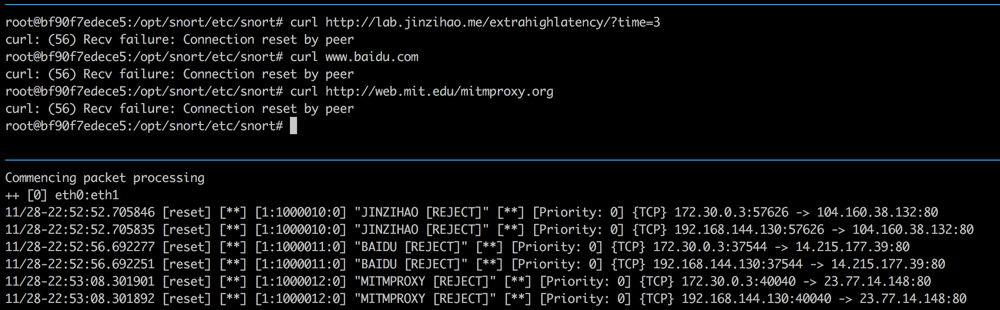
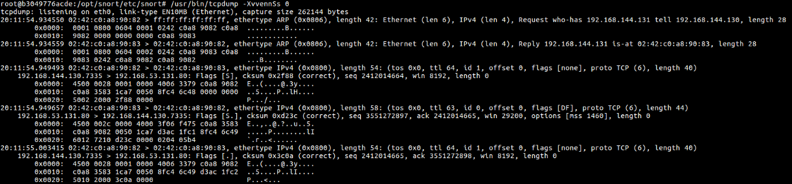
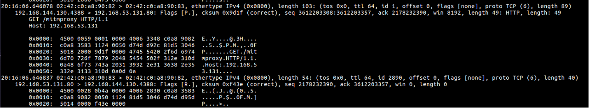
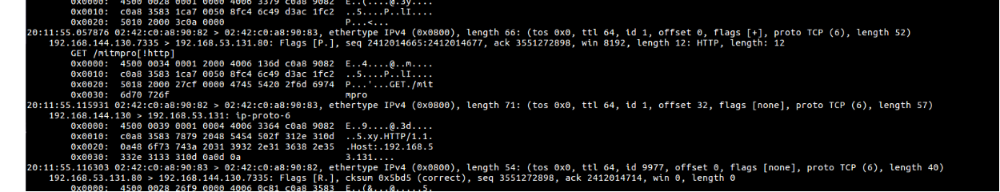
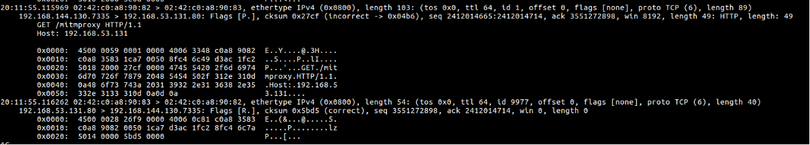
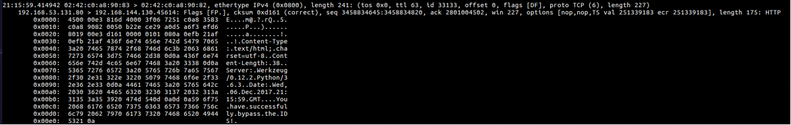
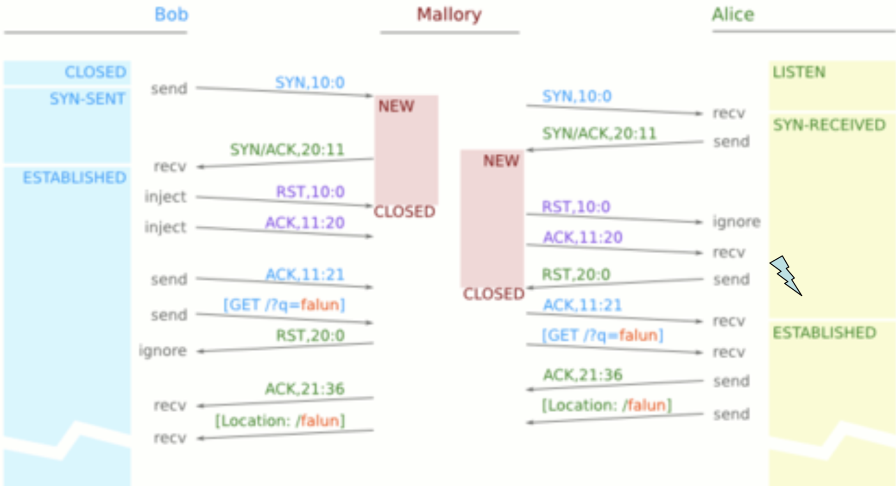
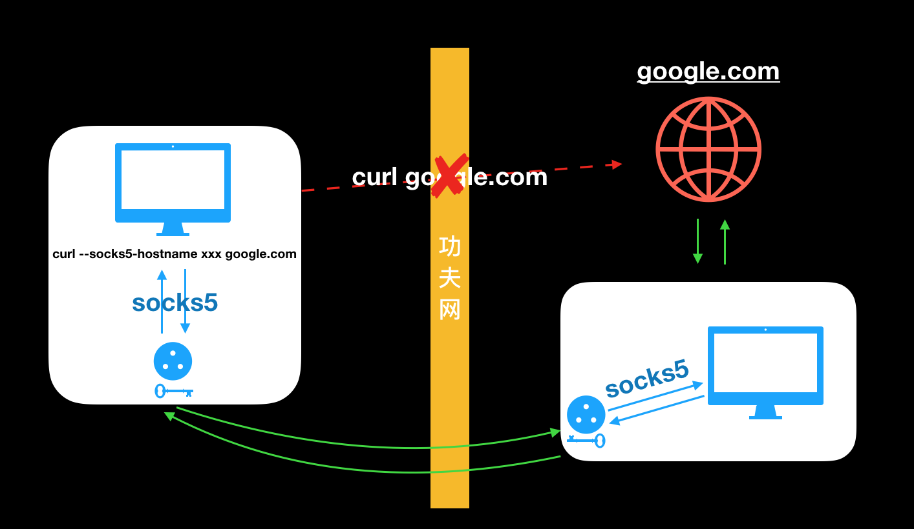
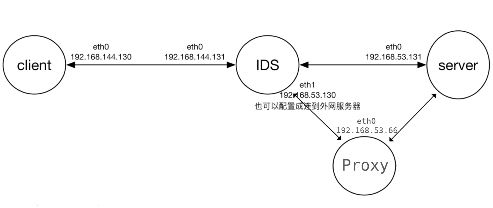

# IDS逃逸实验

---

## 一、问题重述

1、实验目的： 
通过本次实验，深入理解TCP/IP协议的数据格式、TCP连接的建立和终止过程、对TCP连接的攻击方法、和逃逸技术。理解IDS过滤的原理，并设法绕过检测。

2、背景：
某国家级IDS系统会对包括敏感词的HTTP连接进行阻断。例如 http://mit.edu/mitmproxy.org，这个URL所在的页面并不存在，但是其中包含了敏感词，导致连接被阻断；而在没有IDS的环境下，正常的HTTP请求会收到404消息页面。

3、要求：
请结合TCP/IP协议相关知识，以及IDS实现的原理，实现绕过IDS的敏感词过滤，获取http://mit.edu/mitmproxy.org这个URL下返回的404页面。
实际实验设计可参见拓扑图结构，也可自行设计，可将IDS的eth1 配置成访问外网，获取http://mit.edu/mitmproxy.org这个URL下返回的404页面。也可以自己在第三台机器上面自己搭建服务器，来测试收到的流量信息。

可参考的方法如下：
把敏感词拆开，分在不同的 tcp segments 或 IP fragments 里面，外加不同的重叠策略，使请求能够被目标mit.edu正常识别、但是使IDS识别不出来；

在TCP建立连接后、发送敏感词之前，发送RST告诉IDS连接终止（从而放弃监听），但是使目标mit.edu不会接受这个RST。

4、建议使用Scapy来实现，参考资料如下：
官方文档 - http://www.secdev.org/projects/scapy/doc/
非官方新手指南 - http://theitgeekchronicles.files.wordpress.com/2012/05/scapyguide1.pdf
使用Scapy进行分片 - http://www.sans.org/reading-room/whitepapers/detection/ip-fragment-reassembly-scapy-33969
snort 规则教程：http://snort.datanerds.net/writing_snort_rules.htm#first_example

提交实验报告、测试脚本，并准备在课堂上做演示。


## 二、任务实现

### 1. 初步网络拓扑结构

网络拓扑结构采用作业文档中给出的结构，如下图所示：


其中IDS上配置两块虚拟网卡`eth0`和`eth1`，而`client`、`IDS`和`server`分别为一个docker container。类似于前面两次作业的情况，我们提供了`Makefile`来创建 docker image 和 docker container。

### 2. IDS配置

我们尝试使用了多种IDS配置的软件，包括`snort`，`suricata`，`bro`等，在不同程度上进行了实现，在 2.1 和 2.2 中，我们服务器用的是靳子豪同学的高延时网站：http://lab.jinzihao.me/extrahighlatency/?time=3。具体的情况如下：

#### 2.1 IDS的踩坑之旅

##### Snort 2.9

`Snort`是作业推荐的工具，经过学习，我们给出了我们设置的`snort`规则，如下：

```
alert tcp any any -> any any (msg: "TCP [ALERT]!"; sid: 1000004;)
```

但是出现的问题是，我们发现`snort`检测到的包都是从`server`发过来的包，而没有看到`client`发出的包，即使将`snort`规则中的`content`设置为空，设置为空格，设置为`|20|` 都不能看到`client`发出的`GET HTTP` 包。所以就无法匹配并发出`rst`包终止`TCP`连接。

##### Suricata

`Suricata` 是推荐网站上给出的比`snort`更加强大的工具，也是在使用`snort`并与助教和同学们交流之后仍然没有解决之后我们决定转向的工具。`Suricata`的规则撰写方式与`snort`相似，我们使用的`suricata`编写的规则为：

```
alert tcp any any -> any any (msg: "TCP [ALERT]!"; sid: 1000004;)
```

这一次，我们成功在`suricata`的log文件tcp-data.log中看到了我们需要检测到的关键词，即看到了`GET HTTP`包的内容。

但是，问题在于，我们在检测结果的log文件中，并没有看到`GET HTTP`这个包，而且很奇怪的是，只有在使用`Ctrl+c`终止`suricata`之后，才会看到`rst` 的包的记录。这个问题仍然使得我们无法实现`IDS`的功能。

##### Bro

在经过了`snort`和`suricata`的奇怪错误之后，我们转向了更加基础而强大的工具——`Bro`，`Bro`所定义的`Bro script`是一个很强大的工具，在专业研究人员中比较常用，但是学习曲线比较陡峭，对新手友好程度相对较低。

在经过学习之后，我们给出的`Bro`的`Bro Script`如下

```bro
event tcp_packet (c: connection, is_orig: bool, flags: string, seq: count, ack: count, len: count, payload: string) {
    if (/jinzihao/ in payload) {
        print fmt("tcp packet: from <%s:%s, %s> to <%s:%s, %s>", c$id$orig_h, port_to_count(c$id$orig_p), seq, c$id$resp_h, port_to_count(c$id$resp_p), seq + len);
    }
}
```

利用

```shell
$ bro -i eth1 -C main.bro
```

可以利用Bro来监控流量，于是现在，Bro可以检测到我们需要检测的关键词，比如`http://lab.jinzihao.me/extrahighlatency/?time=3`中，我们使用`jinzihao`作为关键词。

但是，`Bro`又出现了另一个问题，即难以发出`rst`包，在经过努力查找之后，我们找到了一个叫做`bro-aux`的`Bro`的插件，里面含有一个叫做`rst`的组件，但是，由于`Bro script`难以调用命令行的指令，所以还是不能实现检测到之后终止`TCP`连接的功能。

总体上看，我们尝试了多种`IDS`软件，但是他们都有着这样那样的问题，均实现了目标`IDS`的部分功能，但是没有一个工具能够实现完整的`检测-匹配-终止`全过程的功能，`Snort2`和`Suricata`可以很容易实现向两端发rst包，但是难以探测到包，`Bro`可以探测一切流量，但是却极其难向两端发rst包。

#### 2.2 Snort 3.0.0的探索（afpacket模式）

在多次尝试失败之后，在绝望中，我们又回到了snort，但是这次，我们不再尝试古老的snort 2，由于cisco对于snort进行了完完全全的重写，于是Snort 3诞生了，我们就开始尝试使用Snort 3。

Snort 3的使用是十分难过的，首先安装十分的困难，Google找了很久，终于找到了一份安装教程：[Installing Snort++ in Ubuntu (Version 3.0 Alpha 4 build 239)](https://sublimerobots.com/2017/08/installing-snort-3-b239-in-ubuntu/)，根据这个我们编写了docker-snort3的`Dockerfile`，详情见代码中的`snort3-build`目录。

然而，比起下面的工作，安装已经是很简单的事情了，关键在于 snort 3 几乎把 snort 2 完全重写了，因此太多不兼容的规则，然而网上资料及其的少，我们唯一能参考的只有Snort官网上的Snort 3的manual。

最终我们编写的snort规则如代码`ids/snort/rules/local.rules`所示，主要规则如下：

```
reject tcp any any -> any any (msg: "JINZIHAO [REJECT]"; content: "jinzihao"; sid: 1000010;)
reject tcp any any -> any any (msg: "BAIDU [REJECT]"; content: "baidu"; sid: 1000011;)
reject tcp any any -> any any (msg: "MITMPROXY [REJECT]"; content: "mitmproxy"; sid: 1000012;)
```

其中我们还在`ids/snort/snort.lua`中添加了以下配置：

```Lua
reject = { 
    reset = 'both',
}
```

此配置使得snort3在执行reject操作的时候，向两侧发rst包。

然而我们以为结束了，其实没那么简单，snort启动也是有坑的，要使得`reject`生效，必须运行在`inline`模式，而且`daq`的模式必须为`afpacket`。因此要在`ids`容器中运行`snort`，则在容器中输入下属命令即可：

```Shell
$ snort -c snort.lua -R rules/local.rules -i eth0:eth1 -A alert_fast -k none --daq afpacket -Q
```

其中`--daq afpacket -Q` 必不可少。

在`ids`中运行`snort`之后，我们及可以在`client`容器中利用下述命令发GET请求：

```shell
$ curl http://lab.jinzihao.me/extrahighlatency/?time=3
$ curl www.baidu.com
$ curl http://web.mit.edu/mitmproxy.org
```

于是可以得到下述结果，其中，顶部为`client`，底部为`ids`。可以看到，`ids`检测到`jinzihao`关键词之后，就会向两侧发起 RST，使得 TCP 连接断开



另外我们还发现，用 snort 3 和 docker 并没有出现其他同学说的 snort 速度慢的问题，我们无论是`curl`高延时的网站还是低延时的baidu，都会被reject掉。

然而，经过我们的仔细分析，我们发现，snort 3运行在此模式下， 不仅`client`会向`server`建立 TCP 连接，`IDS`会额外再建立一条到`server`的连接，于是，当`IDS`检测到关键词之后，`IDS`发送的 RST 只断开了`client`和`server`的 TCP 连接，而`IDS`到`server`的 TCP 的连接并没有断开，于是，服务器依然会回应请求给`IDS`，而`IDS`收到这个消息依然会发给`client`，由于`client`和`server`的 TCP 连接断开了，所以这条返回消息不会回给`curl`，但是我们用`tcpdump`可以抓到这个包。

#### 2.3 终极解决方案——`NFQ`模式

后来，我们经过各种查阅资料了解到，`Linux`有一种模式叫做`nfqueue`模式，可以在用户态获得网络流量，并对流量进行操作和裁决。而`snort2`、`suricata`和`snort3`都是支持这种模式的。因此我们之后考虑用这个模式。

用这个模式首先我们需要在`IDS`中设置流量走NFQEUEU：

```bash
$ iptables -I FORWARD -j NFQUEUE
```

由于`IDS`设置了`NFQ`模式，因此必须要打开防火墙才能访问其他网站，注意此时防火墙的启动方式也有了改变，以`snort3`为例：

```Bash
$ snort -c snort.lua -R rules/local.rules -A alert_fast -k none --daq nfq -Q --plugin-path /opt/snort/lib/snort_extra
```

其他防火墙的启动方式可以参考`ids`文件夹下对应的`Dockerfile`。这里注意的是，要使得`snort2`和`snort3`支持`NFQ`模式，必须保证 Linux 中安装`libnetfilter-queue`等依赖项，具体构建过程可以查看源代码中的`snort2-build`和`snort3-build`文件夹中的`Dockerfile`

之后我们即可以成功的搭建防火墙了。防火墙的测试方法见后文的实验过程。

### 3. 绕过策略

#### 3.1 `IP`分片

我们使用`scapy`实现了`IP`分片来躲避`IDS`检测的功能。

实际上，真正的很多`IDS`是有将分片后的`IP`包重组之后再进行关键词检测的功能的，而遇到这种`IDS`时，我们可以采取文献 `http://www.sans.org/reading-room/whitepapers/detection/ip-fragment-reassembly-scapy-33969`中给出的通过`IP`分片中内容有重叠时的未定义行为，不同的操作系统采取了不同的处理方式，有的是采用先到的数据，有的是采用后到达的数据等等。定向攻击`IDS`没有采用而`server`采取的重组策略，这样`IDS`恢复出的数据与实际上服务器接收到的数据不同，就可以实现绕过`IDS`的检测。

以下对分片算法做简单的说明：

对于一个即将发出去的`scapy`包，我们使用`split`函数进行处理，迭代进行检测关键词是否存在，如果存在，则在关键词中将整个`payload`分成两部分，并且切分位置要是8的倍数。将左侧放入一个`IP packet`中，并将`flags`置为`1`，将`frag`设为当前`payload`的开头，然后对右侧剩余的部分继续检测和拆分。最后，没有了关键词后，将最后的一个`payload`装入`IP`包，并设置`flags`为0，而`frag`为最后一个`payload`的开头。

具体的实现参见脚本`client/src/scapy/split.py`，主要实现函数为其中的`get_by_split`函数。

实现的流程和结果如下：

1. 建立`TCP`连接的三次“握手”

   使用`scapy`实现与服务器`docker`容器的连接，服务器`docker`容器的`IP`地址为`192.168.53.131`，具体的服务器实现代码可参看`server/src/server.py`，其提供了三个可以连接的网址：`192.168.53.131/`，`192.168.53.131/mitmproxy`和`192.168.53.131/mit`，第一个可以正常访问，因为地址和返回内容都没有关键词`mitmproxy`，不会被`IDS`拦截；第二个的地址有关键词`mitmproxy`，会被`IDS`拦截，而返回内容没有；第三个地址没有关键词，而返回内容有关键词`mitmproxy`，所以只有返回内容的`packet`会被`IDS`拦截。

   实现三次“握手”的结果截图如下：

   

2. 使用`scapy`进行`IP`分片

   按照上面所讲的方法进行`IP`分片，访问地址为`192.168.53.131/mitmproxy`，在不进行分片时发出的`GET`包如下所示：

   

   在进行`IP`分片后，得到的两个分片后的包如下：

   

   而经过`IP`包的重组之后得到的包如下：

   

   对比不进行分片的包和进行分片后重组得到的包，我们可以发现，两个包的`payload`是相同的，前面的`IP`头和`TCP`头的地址等也相同，说明分片成功。

3. 将`IDS`的`IP`重组检测关闭，再次进行实验，得到绕过后的结果。

   

   由此可见，绕过成功。


#### 3.2 西厢计划

在课上，老师介绍了西厢计划，这个翻墙方案利用了 TCP 连接的一个漏洞来进行防火墙欺骗。主要原理图如下：

#### 

在上图中，我们可以看到，西厢计划主要是 hack 了 TCP 建立连接的过程，`client`本来应该发 ACK 确认建立连接的时候先发了一个序列号错误的 RST 和 ACK，之后再发正确的 ACK，这么一搅浑水之后，就会使得防火墙认为这个 TCP 连接已经断开了而不再去监听，于是防火墙绕过得以成功。

基于上述原理，我们利用`scapy`实现了西厢计划，具体源码见`client/src/scapy/scholar-zhang.py`，其中核心代码如下：

```python
# hack
rst = l4.copy()
rst[TCP].flags = 'R'
ack = l4.copy()
ack[TCP].flags = 'A'
ack[TCP].ack = syn_ack[TCP].seq
ack[TCP].seq = syn_ack[TCP].ack
send(rst)
send(ack)
```

可以看到这里我们复制了之前发送的`SYN`包，然后对这个包的类型和序号进行修改并发送，即可实现西厢计划。在`client`中直接运行`python3 scapy/scholar-zhang.py`即可运行西厢计划。

然而我们发现，可能由于防火墙内部实现原因，我们的西厢计划并没有成功，防火墙依然发了 RST 阻止我们访问，因此上面的`python`运行会发生错误。这说明我们的防火墙和 GFW 的机制应该是有一些区别的。这种方法绕过我们的防火墙也是行不通的。

#### 3.3 Socks5 代理

由于以上的两种方案我们都没有成功，因此我们考虑采用现在最常用的翻墙方式——`socks5`代理的方法。`socks5`是一种网络传输协议，我们利用`socks5`来绕过防火墙的思路如下图所示：



为了实现上图所示的效果，我们在助教推荐的网络结构上加了一个`proxy`容器，用于 ids 绕过于是网络拓扑结构如下图所示：



于是我们利用`python`手动实现了`socks5`协议，其中服务器代码见`server/src/socks5_server.py`，客户端代码见`client/src/socks5/socks5_client.py`。同时需要注意的是，我们需要用`openssl`生成`cert.pem`和`key.pem`，将`cert.pem`放在和`socks5_client.py`同一目录，`cert.pem`和`key.pem`放在和`socks5_server.py`同一目录。于是即可实现`socks5`翻墙代理。

### 4. 实验过程

我们在这里介绍`socks5`协议翻墙代理的过程。我们利用 docker 建立2个子网，分别是 `ids-net` 和 `outer-net`，利用下述命令可以建立2个子网：

```Shell
$ make create_gateway
```

然后，我们需要 build 并 run 用于测试的 docker 容器：

```Shell
$ make
```

可以看到，我们这里有4个容器：`client`, `ids`, `server`, `proxy`。其中 `server` 我们自行用`flask`实现了一个服务器

我们利用`openssl`生成`key.pem`和`cert.pem`：

```bash
$ openssl req -new -x509 -days 365 -nodes -out cert.pem -keyout key.pem
```

这里需要注意的是，由于我们的`socks5_client.py`中有一行：

```python
ssl_server_tcp = context.wrap_socket(server_tcp, server_hostname='socks5')
```

所以用`openssl`生成证书的时候，注意填写的`hostname`和代码中一致，即`socks5`。生成了`key.pem`和`cert.pem`之后，注意把二者都放在和`socks5_server.py`同目录，把`cert.pem`复制一份放在和`socks5_client.py`同目录。

之后可以分别用下述命令进入`client`, `ids`, `server`, `proxy`：

```Shell
$ make exec_client
$ make exec_ids
$ make exec_server
$ make exec_proxy
```

在`client`容器中，如果我们直接用`curl 192.168.53.131`访问服务器是可以成功的，因为没有关键词，但是当我们使用`curl 192.168.53.131/mitmproxy`访问的时候，会被防火墙 Reset 掉，会收到下述消息：

```
curl: (56) Recv failure: Connection reset by peer
```

因为我们已经设置了 mitmproxy 为敏感词。

此时我们考虑用`sock5`代理来访问，我们运行

```bash
$ curl --socks5-hostname 127.0.0.1:$CLIENT_PORT 192.168.53.131
```

可以看到是可以成功收到回复的，说明`socks5`没有问题，此时我们尝试访问被墙网站

```bash
$ curl --socks5-hostname 127.0.0.1:$CLIENT_PORT 192.168.53.131/mitmproxy
```

我们可以激动的发现，我们成功的访问到了敏感词网站。

当实验结束之后，我们可以利用

```Bash
$ make clean
```

来清除已生成的 docker 容器。

具体操作过程可见`ids_bypass.mov`视频。


## 参考资料

1. IDS 软件相关

- [Installing Snort++ in Ubuntu (Version 3.0 Alpha 4 build 239)](https://sublimerobots.com/2017/08/installing-snort-3-b239-in-ubuntu/)
- [Installing Snort++ Example Plugins](http://sublimerobots.com/2017/08/installing-snort-example-plugins/) 
- [snort 轻量级入侵检测系统安装与使用](http://blog.csdn.net/a821478424/article/details/50951255)
- [Snort IPS With NFQ (nfqueue) Routing on Ubuntu](http://sublimerobots.com/2017/06/snort-ips-with-nfq-routing-on-ubuntu/) 
- [snort3: ERROR: Unable to find a Codec with data link type 228](http://seclists.org/snort/2017/q1/529) 
- [Suricata docs: 11. Setting up IPS/inline for Linux](http://suricata.readthedocs.io/en/latest/setting-up-ipsinline-for-linux.html) 
- [Bro Auxiliary Programs](https://www.bro.org/sphinx/components/bro-aux/README.html) 

2. IDS 原理相关

- [A Python 3 libnetfilter_queue handler](https://gist.github.com/adrelanos/eb4be156e9a12643642a0c5360b2a91b)
- [IPS Packet Acquisition PCAP AFPACKET NFQ NFQ IPS Action replace](https://www.academia.edu/7084691/IPS_Packet_Acquisition_PCAP_AFPACKET_NFQ_NFQ_IPS_Action_replace)
- [simple scapy tcp three-way handshake](https://gist.github.com/tintinweb/8523a9a43a2fb61a6770) 
- [“西厢计划”原理小解](https://blog.youxu.info/2010/03/14/west-chamber/)
- [功夫网与翻墙](http://www.chinagfw.org/2010/04/gfw.html)


3. TCP 分段相关

- [Baggett, Mark. "IP fragment reassembly with scapy." *SANS Institute InfoSec Reading Room* (2012).](https://www.sans.org/reading-room/whitepapers/tools/ip-fragment-reassembly-scapy-33969)
- [Maxwell, Adam. "The very unofficial dummies guide to Scapy." *Retrieved from* (2013).](https://theitgeekchronicles.files.wordpress.com/2012/05/scapyguide1.pdf)


## 致谢

- 感谢助教对实验的解答
- 感谢靳子豪同学的网站 [lab.jinzihao.me/extrahighlatency](http://lab.jinzihao.me/extrahighlatency) 
- 感谢群里大家的讨论给了我们很多的启示