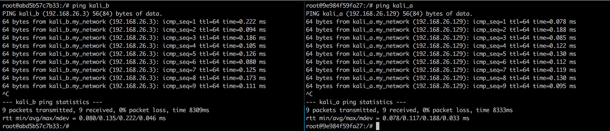
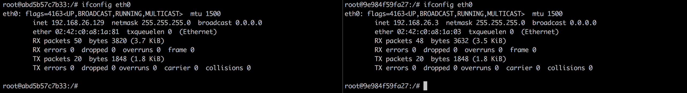
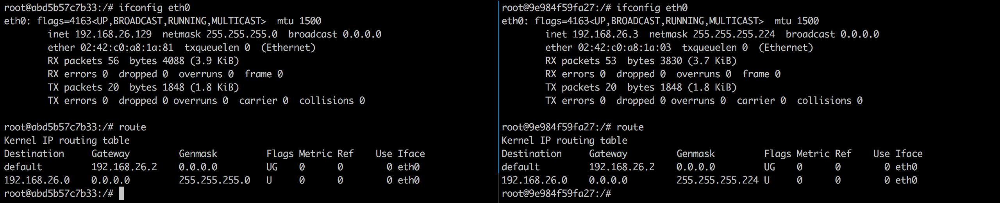
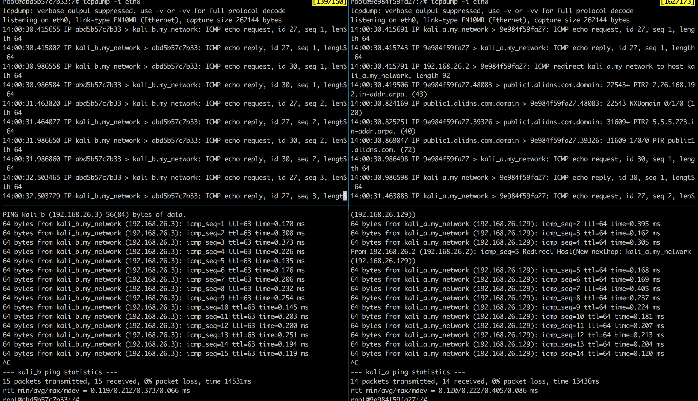

# 网络安全工程作业

---

## 作业

### 作业1

每两个同学一组，搭建实验环境（推荐VM Ware或Virtual Box虚拟机环境）。提交测试分析报告，回答问题并给出测试过程，其中包括关键步骤的截图。

#### 问题

##### 1.1

一个局域网内部的两台计算机A、B的子网应该是`192.168.26.0/24`，网关`192.168.26.2`，A的ip为`192.168.26.129`，B的ip为`192.168.26.3`。其中B的子网掩码本应该是`255.255.255.0`,被不小心配成了`255.255.255.224`。请问A和B之间能否通信？在A上`ping` B的地址，或者从B上`ping` A的地址，测试他们之间的连通性；同时，使用`Wireshark`或`tcpdump`捕获ICMP和ARP的流量，分析通或不通的原因。

##### 1.2

在清华校园网无线网络环境下（SSID 为 Tsinghua) A用校园网账号登录了，B在A的附近连接了同一个WiFi路由器，但没有登录TUNET。 B用什么办法获得A的MAC 和IP？ 如果B修改自己的IP和MAC假冒A的身份，可以做什么？ 

#### 回答

##### 1.1

首先我们先利用docker创建一个子网为`my_network`：

```
$ make create_gateway
```

然后我们需要利用当前的`Dockerfile` build出一个名为`kali`的image

```
$ make build
```

然后利用`kali`的docker image建立2个容器`kali_a`和`kali_b`：

```
$ make run
```

Makefile中的`--dns`是为了让容器在国内访问外网更快一些。之后分别利用`docker exec`进入2容器：

```
$ make exec_a
$ make exec_b
```

两容器是可以互相ping到对方的，如下图所示，其中左边是A，右边是B：



利用`ifconfig`可以查看二者的网络信息：



现在我们在`kali_b`中把子网掩码改为`255.255.255.224`：

```
root@9e984f59fa27:/# ifconfig eth0 192.168.26.3 netmask 255.255.255.224
```

注意更改子网掩码的时候可能会冲掉默认网关，所以需要把默认网关改回来：

```
root@9e984f59fa27:/# route add default gw 192.168.26.2
```

之后再次执行`ifconfig`可以看到右侧`kali_b`的netmask更新为了`255.255.255.224`，同时在两容器中执行`route`可以看到二者的路由表：



之后我们分别在两容器中使用`tcpdump`监听eth0：

```
$ tcpdump -i eth0
```

然后在两容器中分别`ping`对方，在`kali_a`中执行`ping kali_b`，在`kali_b`中执行`ping kali_a`，可以看到下述结果，其中左侧为`kali_a`，右侧为`kali_b`，上半部分为`tcpdump`的结果，下半部分为`ping`的结果：



可以看到，A和B是可以互相ping到的，但是，差别在于，A可以直接ping到B，但是B来ping A的时候，需要经过路由器，因此在B的ping命令中可以看到'Redirect Host'，在tcpdump中也可以清晰的看到B ping A的数据包先到达了192.168.26.2，然后才到达kali_a，而A ping B没有这种现象。

稍加分析，可以发现，将B的子网掩码改为`255.255.255.224`之后，B的子网变成了`192.168.26.224/27`，而A的ip地址`192.169.26.129`并不在子网`192.168.26.224/27`中，因此B不可能在自己的子网中找到A的地址，必须要通过路由器才能发送数据包给A，而A的子网依然是192.168.26.129/24，B是在A的子网中的，因此A是可以直接发送消息给B的。

##### 1.2

同上述方法，我们无法