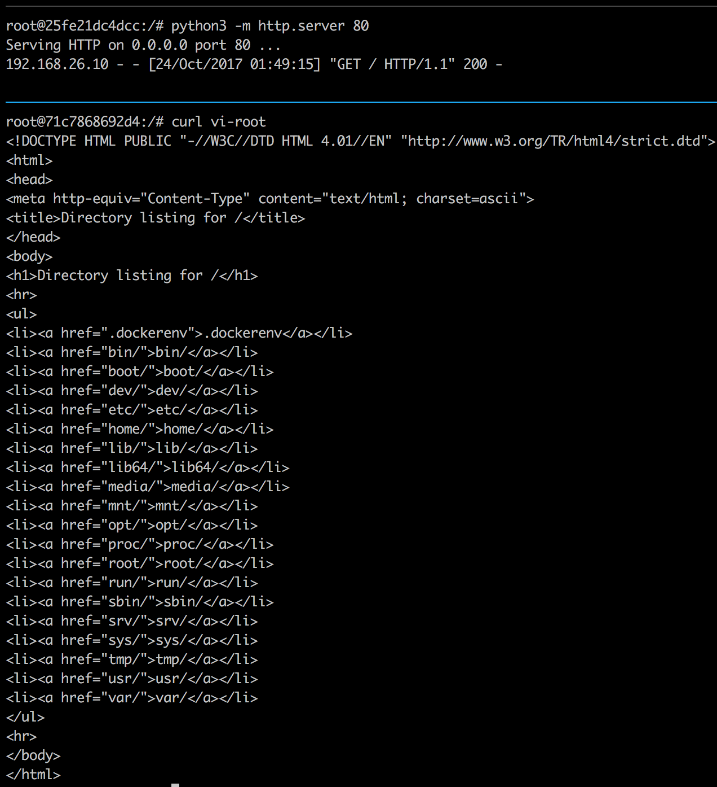
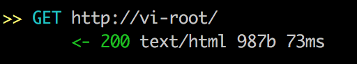
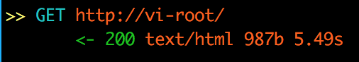
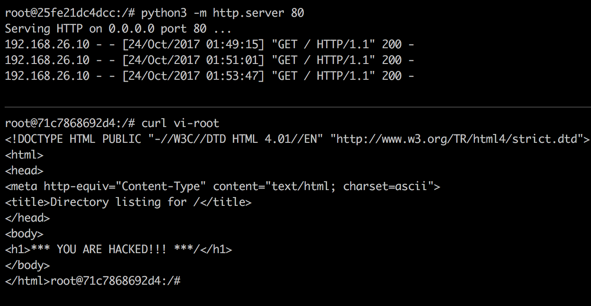

# 中间人攻击实验

---

## 实验描述

### 1. 实验目的

通过本次实验，理解局域网中的安全风险，深入理解ARP欺骗和中间人攻击的工作原理、技术和风险，掌握协议包数据的构造与发送方法。

### 2. 实验环境

处于同一局域网的三台主机（可以使用虚拟机），其中一台主机为攻击机，攻击机使用装有`Scapy`软件包的Linux操作系统。

目前，为实验环境准备两个虚拟机镜像：Ubuntu和kali，百度云网盘链接: https://pan.baidu.com/s/1mhJgubm 密码: yhpb。推荐从清华镜像源下载ubuntu镜像安装，https://mirrors.tuna.tsinghua.edu.cn/# ， 从https://www.kali.org/downloads/ 下载最新版的kali机安装使用，页面有完整版的安装教程可以学习。

Kali为攻击者，Ubuntu作为靶机，并选择如www.baidu.com进行http访问，或公开ftp站点进行ftp实验；也可以利用Ubuntu做两个虚拟机，其中一个虚拟机内自行安装http.ftp server，Kali作为中间人对两个Ubuntu靶机进行实验。

Kali系统： root:hack

Ubuntu系统：root:victim  victim:victim

### 3. 实验过程

在攻击机上利用`Scapy`伪造数据包，对另外两台靶机进行ARP欺骗,实现窃听靶机之间的会话，在实现ARP欺骗的基础上，进一步实现中间人攻击。利用`iptables`修改流量的转发端口，使用`mitmproxy`进行拦截请求，可以获取到请求的参数，从中提取出重要的信息，比如用户名和密码，也能够修改响应，改变返回的内容。`mitmproxy` 提供了inline script 方法，能够使用脚本来操作流量，使得mitmproxy的功能更加强大，当然也可以尝试拦截https的流量，`mitmproxy` 也具有这样的能力。

### 4. 实验要求

要求1：使用Scapy实现窃听另外两台靶机的会话。例如窃听并提取另外两台靶机之间FTP或者HTTP会话的登录账号。

要求2：对另外两台靶机进行中间人攻击，实现对会话进行篡改。例如对靶机间的HTTP会话进行注入，修改HTTP响应。

探索（不做要求）：在实验要求2的基础上，有兴趣的同学可以尝试对https会话进行窃听

### 5. 实验相关材料

a) 利用Netwox进行ARP攻击实验视频过程
视频地址 http://pan.baidu.com/s/1EDCp3

b)  中间人攻击框架mitmproxy
下载地址：https://github.com/mitmproxy/mitmproxy
主页及文档:  http://mitmproxy.org (需翻墙)

c） `scapy` 文档
文档地址：http://www.secdev.org/projects/scapy/doc/
中文版教程：https://github.com/Larryxi/Scapy_zh-cn 
助教：韦俊琳
邮箱：weijl16@mails.tsinghua.edu.cn

## 实验过程

### 1. 建立docker虚拟机

首先用

```shell
$ make build
```

构建docker镜像。

然后我们需要建立虚拟的桥接网络`mitm_net`

```shell
$ make create_gateway
```

最后执行

```Shell
$ make run
```

运行容器

之后分别执行`make exec_root`, `make exec_vic`, `make exec_hack`进入3个容器，其名字分别为vi-root, vi-vic, hack。

### 2. 中间人攻击

在hack容器中，用scapy编写`arp_cache_poison.py`来对vi-root进行arp毒化，其中服务靶机为vi-root，ip为192.168.26.3，客户端靶机为vi-vic，ip为192.168.26.129，设攻击机的投毒网卡为`eth0`，将3个参数放入`arp_cache_poison.py`中，然后运行

```shell
$ python3 arp_cache_poison.py
```

另外我们需要设置一下ip转发表，将流量重定向到`mitmproxy`中，注意我们以`eth0`为网卡作为测试

```Shell
$ sudo iptables -t nat -A PREROUTING -i eth0 -p tcp --dport 80 -j REDIRECT --to-port 8080
$ sudo iptables -t nat -A PREROUTING -i eth0 -p tcp --dport 443 -j REDIRECT --to-port 8080
```

然后我们可以在hack容器中以transparent模式运行`mitmproxy`

```shell
$ mitmproxy -T --host
```

在vi-root中用python3启动测试服务器

```shell
$ python3 -m http.server 80
```

在vi-vic中用`curl`访问vi-root的ip如下

```shell
$ curl vi-root
```

或者

```shell
$ curl 192.168.26.3
```

可以收到服务端靶机的回复，服务端靶机也可以看到客户端靶机的访问记录，如下截图，其中上面的为服务端靶机，下面的为客户端靶机



然而在hack容器中的`mitmproxy`中，我们可以清晰的看到，我们监听到了这个`curl`访问请求：



更多的，我们可以在`mitmproxy`中使用`i`来截获某个ip，例如`192.168.26.3`，截获此ip的包之后，可以对包的内容进行修改和伪造，然后重新发给接收人，达到信息伪造的目的。示例如下：

我们先用`i`来截获所有ip为`192.168.26.3`的包，然后在vi-vic中向vi-root发一个curl请求，先在`mitmproxy`中用`a`放行发送的ip包，然后我们会截获接收的ip包如下：



按回车进入ip包，可以编辑ip包的内容，我们编辑了一下ip包的body，然后按`a`放心，于是我们可以发现，客户端靶机接收到的内容被修改和伪造了：



中间人攻击成功！