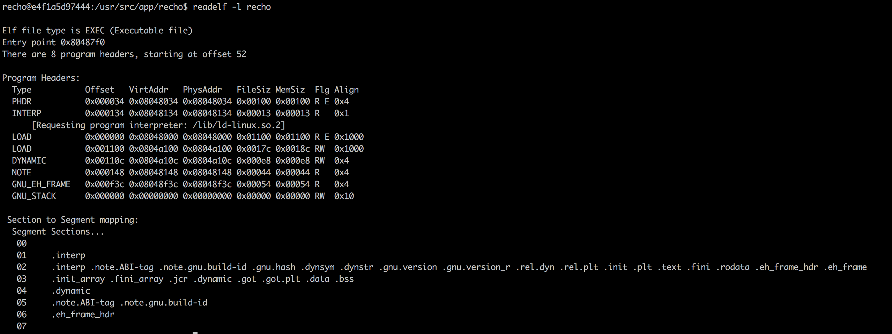
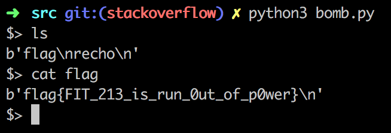

#  软件漏洞利用

---

## 一、实验要求

在 `recho` 文件夹中包含源文件，编译之后的可执行文件，以及与可执行文件配套的`libc`库（可以用系统自带的库，但是分析结果稍有不同）。

代码中包含一个栈溢出漏洞，可以被攻击者利用，劫持控制流执行恶意代码（例如获取`shell`执行任意命令）。

请先在本地进行分析，找到漏洞，以及写好利用脚本（可以用`zio`或者`pwntools`辅助），然后连接服务器测试（`120.76.114.164`，端口` 1234`），获取服务器中的`flag`文件的内容，拿到`flag`即为攻击成功。

请撰写实验报告，包括漏洞分析结果，漏洞利用原理，漏洞利用代码，以及拿到的服务器`flag`。


## 二、本地测试过程

### 2.1 代码分析

在代码的根目录利用

```bash
$ make
```

启动本实验的 `docker` 容器，然后运行

```bash
$ make dump
```

可以在 `src/dump/recho.s` 获得 `recho` 的反汇编代码。我们主要分析里面的 `handle` 函数的代码，寻找缓冲区的位置：

```assembly
08048af4 <handle>:
 8048af4:	55                   	push   %ebp
 8048af5:	89 e5                	mov    %esp,%ebp
 8048af7:	81 ec 08 01 00 00    	sub    $0x108,%esp
 8048afd:	83 ec 04             	sub    $0x4,%esp
 8048b00:	68 00 01 00 00       	push   $0x100
 8048b05:	6a 00                	push   $0x0
 8048b07:	8d 85 f8 fe ff ff    	lea    -0x108(%ebp),%eax
 8048b0d:	50                   	push   %eax
 8048b0e:	e8 3d fc ff ff       	call   8048750 <memset@plt>
 8048b13:	83 c4 10             	add    $0x10,%esp
 8048b16:	83 ec 0c             	sub    $0xc,%esp
 8048b19:	68 c4 8e 04 08       	push   $0x8048ec4
 8048b1e:	e8 ac ff ff ff       	call   8048acf <sendstr>
 8048b23:	83 c4 10             	add    $0x10,%esp
 8048b26:	83 ec 0c             	sub    $0xc,%esp
 8048b29:	8d 85 f8 fe ff ff    	lea    -0x108(%ebp),%eax
 8048b2f:	50                   	push   %eax
 8048b30:	e8 b1 fe ff ff       	call   80489e6 <recv_line>
 8048b35:	83 c4 10             	add    $0x10,%esp
 8048b38:	83 ec 0c             	sub    $0xc,%esp
 8048b3b:	8d 85 f8 fe ff ff    	lea    -0x108(%ebp),%eax
 8048b41:	50                   	push   %eax
 8048b42:	e8 88 ff ff ff       	call   8048acf <sendstr>
 8048b47:	83 c4 10             	add    $0x10,%esp
 8048b4a:	c9                   	leave  
 8048b4b:	c3                   	ret    
```

### 2.2 实验操作过程

经过上述的 `make` 操作，我们的 `docker` 容器已经运行了起来，之后我们利用

```bash
$ make exec
```

可以进入容器操作。注意我们此时进入的是 `recho` 用户，此用户有 `sudo` 权限，密码为 `recho`，详情见 `Dockerfile` 文件。

#### 2.2.1 初步尝试

从 `0x8048af7` 行我们可以看出，缓冲区的起始地址在 `-0x108(%ebp)`，另外我们可以知道，`handle` 函数的返回地址在 `0x8(%ebp)` 处；`old %ebp` 的地址在 `0x4(%ebp)` 处。于是要想修改返回地址，只需投喂 `0x108 + 0x8 + 0x4 = 0x114`，即 `276` 字节的数据给 `buf` 即可，其中后 `4` 个字节改为自己想跳转的地址。

我们最初是打算使用跳转到`shellcode`的方式来获得`bash`权限的，但是实际的操作发现，这种方式并不能成功，于是我们在 `docker` 容器中使用`readelf`命令来得到内存布局和权限的信息：

```bash
$ readelf -l recho
```

该命令的返回结果如下：

在上图的`Flg`一列可以看到读、写和执行的权限，由此可以，我们可以进行`写`操作的内存区域都是不可执行的，因此，如果将`shellcode`写入栈中，是不能直接执行的。

#### 2.2.2 Ret2lib

于是我们采用了`ret2lib`的方式——通过返回到`libc.so.6`中的`system`函数来获得`bash`权限，而由于`system`需要一个字符串作为参数，所以我们需要将`bash`字符串写入栈中。

`system`函数的地址获取，由于各个函数在`libc`中的相对位置是不变的，所以可以通过`nm`命令查看`send`（或`recv`）的地址和`system`的相对地址，进而通过在连接服务后利用`sendlen`将`send`（或`recv`）函数的实际地址发回，就可以计算出`system`的地址。

以下`nm`命令：

```bash
$ nm-D libc.so.6
```

得到的`send`、`recv`、`system`在`libc.so.6`中的地址如下：

```bash
000e8060 W recv
000e81e0 W send
0003ada0 W system
```

利用上面的结果和程序运行时返回的`send`（或`recv`）的地址，就可以获取到`system`的地址。

由此可见，我们需要多次进行缓冲区溢出操作：

1. 第一次，让`handle`的返回地址变为`sendline`的地址，并发送`send`（或`recv`，实际代码中使用的是`send`）的地址，由此可以计算出`system`的地址
2. 第二次，让`handle`的返回地址变为`recvline`的地址，进而通过本地的`send`将`bash`字符串写入栈
3. 第三次，让`handle`的返回地址变为`system`的地址，进而获得`bash`，并进行命令的输入和结果的获取。
4. 实际的代码中，由于我们不知道`flag`文件是否在当前目录下，所以有可能需要多次调用`system`，于是，`Python3`脚本中使用了`while`循环，可以多次进行`bash`命令，如`ls`和`cat`的使用。

需要指出的是，上面的调用过程中，我们在通过缓冲区溢出修改`handle`的返回值地址之后，设置修改后将要跳转到的函数的返回值地址为`handle`，这样就可以实现上面的多次缓冲区溢出操作了。

每次写入的数据的结构如下：

```python
>>> content = ‘0’*264 + ebp + func + handle_addr + arguments
```

其中，`func`为目标跳转函数地址，可以通过本地的`gdb`进行`debug`得到，`handle_addr`是`handle`函数的地址，而`arguments`则是`func`函数需要的参数列表。


## 三、远端测试过程

我们将代码中的 `host` 改为测试服务器地址 `120.76.114.164`，然后运行 `bomb.py`，然后我们可以获取远程终端，然后利用 `ls`，可以获得当前目录的文件，然后 `cat flag` 即可以获取 `flag`如下：




