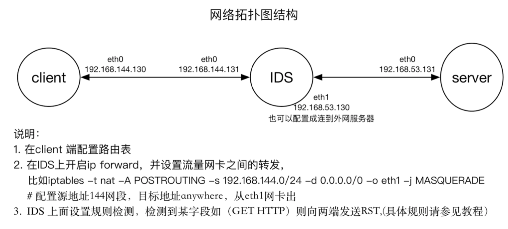

# IDS逃逸实验

李凯文 2014011756 工物40  黄维啸  力2

## 问题重述

1、实验目的： 
通过本次实验，深入理解TCP/IP协议的数据格式、TCP连接的建立和终止过程、对TCP连接的攻击方法、和逃逸技术。理解IDS过滤的原理，并设法绕过检测。

2、背景：
某国家级IDS系统会对包括敏感词的HTTP连接进行阻断。例如 http://mit.edu/mitmproxy.org，这个URL所在的页面并不存在，但是其中包含了敏感词，导致连接被阻断；而在没有IDS的环境下，正常的HTTP请求会收到404消息页面。

3、要求：
请结合TCP/IP协议相关知识，以及IDS实现的原理，实现绕过IDS的敏感词过滤，获取http://mit.edu/mitmproxy.org这个URL下返回的404页面。
实际实验设计可参见拓扑图结构，也可自行设计，可将IDS的eth1 配置成访问外网，获取http://mit.edu/mitmproxy.org这个URL下返回的404页面。也可以自己在第三台机器上面自己搭建服务器，来测试收到的流量信息。

可参考的方法如下：
把敏感词拆开，分在不同的 tcp segments 或 IP fragments 里面，外加不同的重叠策略，使请求能够被目标mit.edu正常识别、但是使IDS识别不出来；

在TCP建立连接后、发送敏感词之前，发送RST告诉IDS连接终止（从而放弃监听），但是使目标mit.edu不会接受这个RST。

4、建议使用Scapy来实现，参考资料如下：
官方文档 - http://www.secdev.org/projects/scapy/doc/
非官方新手指南 - http://theitgeekchronicles.files.wordpress.com/2012/05/scapyguide1.pdf
使用Scapy进行分片 - http://www.sans.org/reading-room/whitepapers/detection/ip-fragment-reassembly-scapy-33969
 snort 规则教程：http://snort.datanerds.net/writing_snort_rules.htm#first_example

提交实验报告、测试脚本，并准备在课堂上做演示。

## 任务实现

### 网络拓扑结构

网络拓扑结构采用作业文档中给出的结构，其中IDS上配置两块虚拟网卡，用docker实现，分别



其中，server端使用靳子豪同学提供的能够自定义延时时间的网址:

`http://lab.jinzihao.me/extrahighlatency/?time=3`

而client和IDS分别为一个docker container。类似于前面两次作业的情况，我们提供了Makefile来创建docker image和docker container。

首先创建网络

```
$ make create_gateway
```

然后build出docker images

```d
$ make build
```

然后建立两个容器`client`和`ids`

```
$ make run
```

Makefile中的`--dns`是为了让容器在国内访问外网更快一些。之后分别利用`docker exec`进入2容器：

```
$ make exec_a
$ make exec_b
```

### IDS配置

我们尝试使用了多种IDS配置的软件，包括`snort`，`suricata`，`bro`等，在不同程度上进行了实现，具体的情况如下：

#### Snort

`Snort`是作业推荐的工具，经过学习，我们给出了我们设置的`snort`规则，如下：

```
alert tcp any any -> any any (msg: "TCP [ALERT]!"; sid: 1000004;)
```

但是出现的问题是，我们发现`snort`检测到的包都是从`server`发过来的包，而没有看到`client`发出的包，即使将`snort`规则中的`content`设置为空，设置为空格，设置为`|20|` 都不能看到`client`发出的`GET HTTP` 包。所以就无法匹配并发出`rst`包终止`TCP`连接。

#### Suricata

`Suricata` 是推荐网站上给出的比`snort`更加强大的工具，也是在使用`snort`并与助教和同学们交流之后仍然没有解决之后我们决定转向的工具。`Suricata`的规则撰写方式与`snort`相似，我们使用的`suricata`编写的规则为：

```
alert tcp any any -> any any (msg: "TCP [ALERT]!"; sid: 1000004;)
```

这一次，我们成功在`suricata`的log文件tcp-data.log中看到了我们需要检测到的关键词，即看到了`GET HTTP`包的内容。

但是，问题在于，我们在检测结果的log文件中，并没有看到`GET HTTP`这个包，而且很奇怪的是，只有在使用`Ctrl+C`终止`suricata`之后，才会看到`rst` 的包的记录。这个问题仍然使得我们无法实现`IDS`的功能。

#### Bro

在经过了`snort`和`suricata`的奇怪错误之后，我们转向了更加基础而强大的工具——`Bro`，`Bro`所定义的`Bro script`是一个很强大的工具，在专业研究人员中比较常用，但是学习曲线比较陡峭，对新手友好程度相对较低。

在经过学习之后，我们给出的`Bro`的`Bro Script`参见附件。

现在，Bro可以检测到我们需要检测的关键词，比如`http://lab.jinzihao.me/extrahighlatency/?time=3`中，我们使用`jinzihao`作为关键词。

但是，`Bro`又出现了另一个问题，即难以发出`rst`包，在经过努力查找之后，我们找到了一个叫做`bro-aux`的`Bro`的插件，里面含有一个叫做`rst`的组件，但是，由于`Bro script`难以调用命令行的指令，所以还是不能实现检测到之后终止`TCP`连接的功能。


总体上看，我们尝试了多种`IDS`软件，但是他们都有着这样那样的问题，均实现了目标`IDS`的部分功能，但是没有一个工具能够实现完整的`检测-匹配-终止`全过程的功能。


### 绕过策略

我们使用`scapy`实现了`IP`分片来躲避`IDS`检测的功能。

实际上，真正的很多`IDS`是有将分片后的`IP`包重组之后再进行关键词检测的功能的，而遇到这种`IDS`时，我们可以采取文献 `http://www.sans.org/reading-room/whitepapers/detection/ip-fragment-reassembly-scapy-33969`中给出的通过`IP`分片中内容有重叠时的未定义行为，不同的操作系统采取了不同的处理方式，有的是采用先到的数据，有的是采用后到达的数据等等。定向攻击`IDS`没有采用而`server`采取的重组策略，这样`IDS`恢复出的数据与实际上服务器接收到的数据不同，就可以实现绕过`IDS`的检测。

我们这里只是实现了`IP`分片，后面的时间主要都用在配置`IDS`上面。实际上，想要实现以上机制是比较容易的——只需要在发包之前自行对关键词进行检测，然后在需要的位置设置随机填充，使得目标`server`能够接收到正确的信息，而`IDS`重组出的数据是错误的。

以下对分片算法做简单的说明：

对于一个即将发出去的`scapy`包，我们使用`split`函数进行处理，迭代进行检测关键词是否存在，如果存在，则在关键词中将整个`payload`分成两部分，并且切分位置要是8的倍数。将左侧放入一个`IP packet`中，并将`flags`置为`1`，将`frag`设为当前`payload`的开头，然后对右侧剩余的部分继续检测和拆分。最后，没有了关键词后，将最后的一个`payload`装入`IP`包，病设置`flags`为0，而`frag`为最后一个`payload`的开头。

具体的实现参加脚本`split.py`。