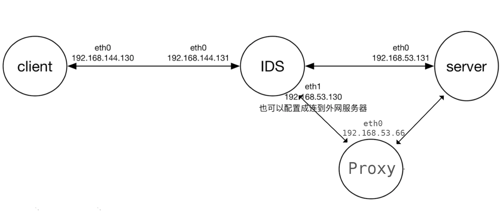

# 安全代理的设计与实现

---

## 一、实验要求

基于SOCKS，利用密码算法设计一个安全的代理协议，具有认证、加密、完整性保护等功能，示意图如下：


## 二、实验方法

### 1. 实验思路

我们主要的思路如下：

- 利用 `Python` 实现 `socks5` 协议
- 利用 `openssl` 生成证书，实现 `TLS` 加密功能
- 在客户端和服务端来运行 `socks5` 脚本，利用 `curl`来测试是否成功代理：`curl -socks5-hostname YOUR_PROXY_ADDR_PORT www.google.com`

关于 `socks5` 协议的相关知识，我们查阅了相关的资料，最后参考了这一篇资料：[socks代理服务器协议的说明](https://my.oschina.net/u/660063/blog/201187)，在此不在赘述，具体实现细节可以查看代码。

### 2. 实验过程

#### 2.1 实验代码分析

客户端代码为 `client/src/socks5/socks5_client.py`，服务端代码为 `proxy/src/socks5_server.py`，其中主要核心部分是 `TLSTCPServer` 类，在这个类中做了 `socks5` 协议的解析相关的操作，同时我们利用 `python` 提供的 `ThreadingMixIn` 类和 `TCPServer` 比较方便的实现了多线程的 TCP 连接。具体细节参见代码。

#### 2.2 建立实验网络

在这里，我们直接利用之前我们 `ids` 绕过实验的网络结构：



我们利用 docker 建立2个子网，分别是 `ids-net` 和 `outer-net`，即下述命令：

```shell
$ make create_gateway
```

然后，我们需要 build 并 run 用于测试的 docker 容器：

```shell
$ make
```

可以看到，我们这里有4个容器：`client`, `ids`, `server`, `proxy`。其中 `server` 我们自行用`flask`实现了一个服务器

#### 2.3 `openssl` 生成证书

为实现客户端和代理服务器的安全通信，我们选择用 `openssl` 生成秘钥和证书 `key.pem` 和 `cert.pem` ：

```bash
$ openssl req -new -x509 -days 365 -nodes -out cert.pem -keyout key.pem
```

这里需要注意的是，由于我们的`socks5_client.py`中有一行：

```python
ssl_server_tcp = context.wrap_socket(server_tcp, server_hostname='socks5')
```

所以用`openssl`生成证书的时候，注意填写的`hostname`和代码中一致，即`socks5`。生成了`key.pem`和`cert.pem`之后，注意把二者都放在和`socks5_server.py`同目录，把`cert.pem`复制一份放在和`socks5_client.py`同目录。

#### 2.4 测试过程

分别用下述命令进入`client`, `ids`, `server`, `proxy`：

```shell
$ make exec_client
$ make exec_ids
$ make exec_server
$ make exec_proxy
```

在`client`容器中，如果我们直接用`curl 192.168.53.131`访问服务器是可以成功的，因为没有关键词，但是当我们使用`curl 192.168.53.131/mitmproxy`访问的时候，会被防火墙 Reset 掉，会收到下述消息：

```
curl: (56) Recv failure: Connection reset by peer
```

因为我们已经设置了 mitmproxy 为敏感词。

此时我们考虑用`sock5`代理来访问，我们运行

```bash
$ curl --socks5-hostname 127.0.0.1:$CLIENT_PORT 192.168.53.131
```

可以看到是可以成功收到回复的，说明`socks5`没有问题，此时我们尝试访问被墙网站

```bash
$ curl --socks5-hostname 127.0.0.1:$CLIENT_PORT 192.168.53.131/mitmproxy
```

我们可以发现，我们成功的利用 `socks5` 代理的办法访问到了敏感词网站。

当实验结束之后，我们可以利用

```bash
$ make clean
```

来清除已生成的 docker 容器。


## 三、接受实践的检验

以上是我们的测试过程，下面我们来讲述一下如何用我们的代码实现真正的在浏览器中翻墙的操作。

